<div align="center">

<!-- Animated cozy room header -->


</div>

<!-- Wave divider -->


## `$ whoami`

I'm **ericsocrat** — a product builder from Cyprus, based in Kraków, Poland. My background is in Marine Engineering & Naval Architecture, but my passion has always been in technology and building things.

Day job: global supply-chain ops in maritime. Nights & weekends: building data products.

I don't come from a traditional CS background. Instead, I leverage **AI agents and strategic product thinking** to turn ideas into production-grade software. I design the architecture, define the data models, write the specs, and make every product decision — then work with AI tools like GitHub Copilot to execute at speed.

The result? Large automated test suites, CI gates (unit + E2E + security scanning), and solid engineering practices — ready to ship.

```typescript
const eric = {
  role:       "Product Builder & AI Strategist",
  from:       "Cyprus 🇨🇾",
  based:      "Kraków, Poland 🇵🇱",
  superpower: "Turning vision into production software via AI agents",
  focus:      ["Data Products", "AI-Augmented Development", "Open Source"],
  stack:      ["Next.js", "Python", "PostgreSQL", "Supabase", "FastAPI"],
  method:     "Architecture + AI Agents + QA-first workflow",
  principle:  "No data ships without automated verification",
};
```


## ⚡ Featured Projects

<table>
<tr>
<td width="50%" valign="top">

### 🍎 [Poland Food DB](https://github.com/ericsocrat/poland-food-db)

**World-class food quality database** scoring 1,025+ products sold in Poland using a 9-factor weighted algorithm based on nutritional science and EU regulatory guidelines.

`PLpgSQL` `Python` `Next.js` `Supabase`

- 🔬 9-factor scoring algorithm with 4 independent quality axes
- 📊 Full nutritional breakdown per product (macros, micros, additives)
- 🔗 97.3% EAN barcode coverage across all categories
- 🛡️ Large automated test suite + CI gates (unit + E2E + security scanning)
- 🏗️ 26 CHECK constraints + 4 FK reference tables for data integrity

> **Recommendation:** If you're interested in food-tech data pipelines or scoring algorithms, start with the `db/pipelines/` directory — each category has its own self-contained SQL pipeline.

</td>
<td width="50%" valign="top">

### 📈 [Lokifi](https://github.com/ericsocrat/Lokifi)

**Market + Social + AI Super-App.** Trading charts, indicators, social feed, alerts, and Deep Research integration.

`TypeScript` `Next.js` `FastAPI` `Redis`

- 📉 Advanced charts & technical indicators
- 🤖 AI-powered research & deep analysis engine
- 🔐 CodeQL scanning + Renovate bot for dependency security
- ⚡ Automated CI/CD pipeline with branch protection
- 🧩 Modular architecture — API, frontend, and workers are fully decoupled

> **Recommendation:** Check the API contracts and the deep-research integration if you're exploring AI-augmented financial UX patterns.

</td>
</tr>
</table>


## 🧠 How I Build

I work at the intersection of **product thinking** and **AI-augmented execution**:

- **Architecture first** — I design the database schemas, API contracts, and system structure before writing code
- **AI as my engineering partner** — I direct Copilot agents with precise strategy and context
- **QA-first workflow** — Large automated test suite + CI gates (unit + E2E + security scanning)
- **Ship fast, ship right** — CI/CD pipelines, branch protection, automated deployment on every merge

Every commit goes through automated gates. Every data point is verified. Every deployment is green.


## 🛠 Tech Stack

<div align="center">

**Core Technologies**


**Frameworks & Platforms**


**Quality & Automation**


</div>


## 📬 Let's Connect

<div align="center">

<a href="https://www.linkedin.com/in/ericsocrat/">
  
</a>
<a href="https://github.com/ericsocrat">
  
</a>

</div>

---

<div align="center">

**`building things that matter`**

</div>
